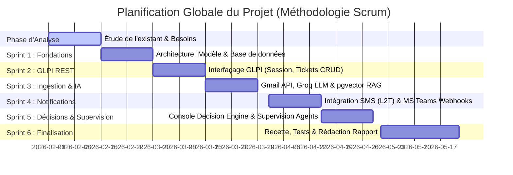
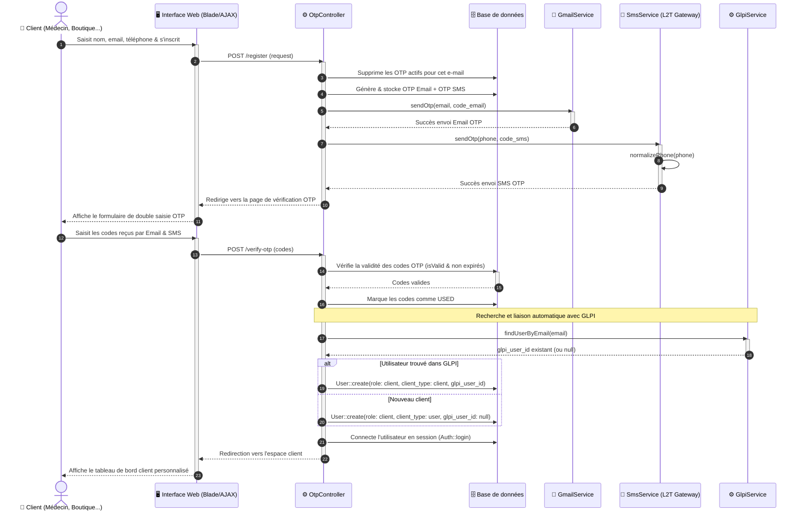
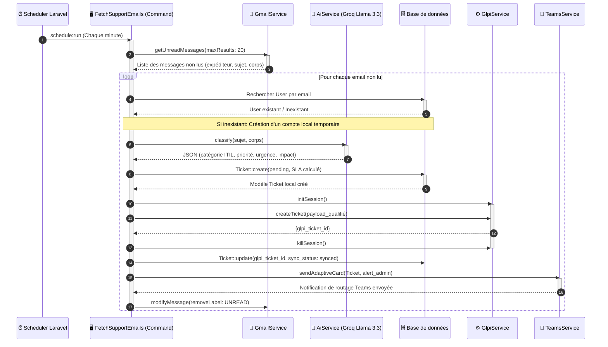
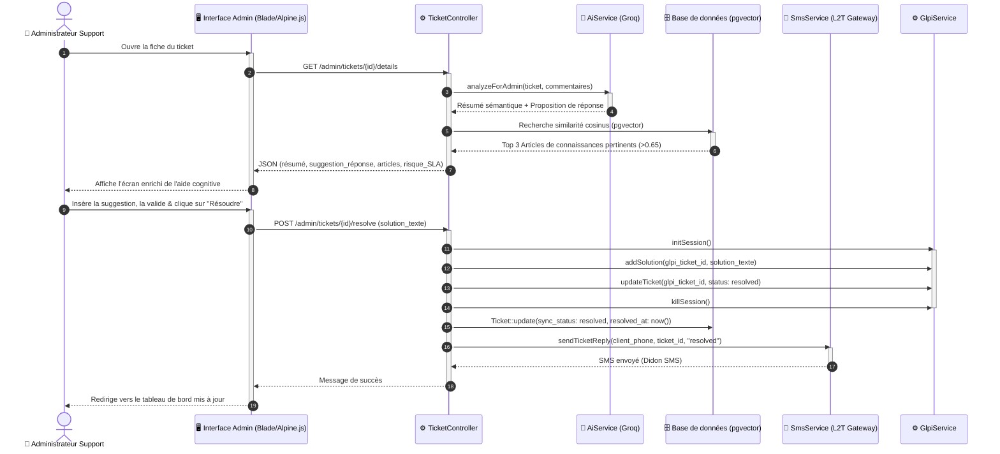

# RAPPORT DE PROJET DE FIN D'ÉTUDES
## Sujet : Conception et Réalisation d'une Plateforme d'Assistance Clientèle Intelligente Intégrée à GLPI avec IA Générative (Laravel 12 - Groq Llama 3.3 - pgvector RAG)

*Réalisé dans le cadre de l'obtention du Diplôme National d'Ingénieur / Licence en Informatique*
*Organisme d'accueil : **L2T (Landolsi Telecom Technology)***

---

## INTRODUCTION GÉNÉRALE

Dans le paysage contemporain des technologies de l'information, la qualité du support client et de la gestion des services informatiques (ITSM) constitue un pilier stratégique pour la compétitivité et la pérennité des entreprises. L'augmentation exponentielle des demandes d'assistance, combinée à l'exigence croissante de réactivité de la part des utilisateurs, exerce une pression constante sur les équipes de support technique. Traditionnellement, la gestion des tickets d'assistance repose sur des processus manuels de tri, de classification et d'assignation, souvent générateurs de goulots d'étranglement et de délais de résolution prolongés.

Pour répondre à ces défis, l'intégration de l'Intelligence Artificielle (IA) générative et des technologies de recherche sémantique avancée offre des perspectives de transformation majeures. Les modèles de langage de grande taille (LLM), combinés à des systèmes de génération augmentée par récupération (RAG - Retrieval-Augmented Generation), permettent d'automatiser intelligemment les premières étapes du support client : compréhension sémantique de la demande, classification automatique, détection de doublons ou de tickets similaires résolus, et suggestion de réponses adaptées basées sur des bases de connaissances institutionnelles.

C'est dans ce contexte que s'inscrit le présent projet de fin d'études, réalisé au sein de l'entreprise **L2T (Landolsi Telecom Technology)**, spécialisée dans les solutions de télécommunications et de messagerie SMS. L'objectif principal de ce projet est de concevoir et de développer une plateforme d'assistance clientèle intelligente faisant office de passerelle entre les canaux de communication entrants (Gmail, portail web, SMS, WhatsApp) et le progiciel de gestion de parc informatique et d'assistance **GLPI (Gestionnaire Libre de Parc Informatique)**.

Cette plateforme, bâtie sur le framework **Laravel 12**, intègre des capacités d'IA avancées via l'API **Groq (modèle Llama 3.3-70b-versatile)**, une base RAG exploitant l'extension **pgvector** de **PostgreSQL** pour stocker les embeddings vectoriels d'articles et d'analyses visuelles, ainsi qu'un moteur de décision (Decision Engine) supervisant le routage des tickets. Elle intègre également des mécanismes de notification en temps réel via **Microsoft Teams** et **SMS** (via les infrastructures propres de L2T).

Ce rapport détaille les phases successives de notre travail de recherche, d'analyse, de conception et de réalisation. Il s'articule autour de quatre chapitres principaux :
*   **Chapitre 1 : Cadre général du projet**, qui présente le contexte d'accueil, la problématique identifiée, la solution proposée et la méthodologie Scrum adoptée.
*   **Chapitre 2 : Analyse et spécification des besoins**, qui détaille l'identification des acteurs, les exigences fonctionnelles et non fonctionnelles, illustrées par des cas d'utilisation modélisés en UML.
*   **Chapitre 3 : Conception**, qui décrit l'architecture globale (physique et logique), le modèle de données sémantique et relationnel (22 tables), ainsi que les diagrammes de classes et de séquences associés.
*   **Chapitre 4 : Réalisation et mise en œuvre**, qui présente l'environnement logiciel retenu, les technologies employées et détaille le fonctionnement ergonomique et logique des interfaces implémentées.
Enfin, une conclusion générale dressera le bilan de ce projet et ouvrira sur les perspectives d'évolution futures de la plateforme.

---

## CHAPITRE 1 : CADRE GÉNÉRAL DU PROJET

### 1.1. Introduction
Le premier chapitre pose les bases de notre projet de fin d'études. Il introduit l'organisme d'accueil au sein duquel ce projet a été mené, définit avec précision les objectifs opérationnels et les problématiques techniques à résoudre, présente la solution conçue et formalise le cadre méthodologique (Agile Scrum) qui a guidé l'ensemble de nos cycles de développement.

### 1.2. Présentation de l’organisme d’accueil

#### 1.2.1. Présentation de l’organisme d’accueil
Le projet a été développé au sein de **L2T (Landolsi Telecom Technology)**. L2T est un acteur majeur et innovant dans le domaine des télécommunications et des services à valeur ajoutée (VAS) en Tunisie. Fondée pour répondre à la demande croissante d'intégration des canaux de communication mobiles dans les stratégies d'entreprise, L2T s'est forgé une solide réputation dans la fourniture de passerelles SMS à haut débit et de solutions de communication unifiée.

#### 1.2.2. Domaine d’activité
Le domaine d'activité principal de L2T s'articule autour de :
*   **Le SMS Marketing et Professionnel** : Diffusion de SMS en masse (Bulk SMS) pour les campagnes publicitaires, alertes transactionnelles et notifications système (Didon SMS, Cloud Messaging).
*   **Les Authentifications OTP (One-Time Password)** : Services de validation de transactions et de double authentification sécurisée par SMS pour les banques, institutions financières et plateformes web.
*   **Le Micropaiement Mobile** : Solutions d'intégration de facturation opérateur (Direct Carrier Billing) permettant aux éditeurs d'applications de collecter des paiements via le crédit de communication mobile des utilisateurs tunisiens (Tunisie Telecom, Ooredoo, Orange).
*   **L'Intégration d'API télécoms** : Fourniture de connecteurs robustes (REST, SMPP) pour interfacer les progiciels d'entreprise avec les réseaux mobiles.

#### 1.2.3. Fiche signalétique
La fiche ci-dessous présente les informations administratives clés de l'entreprise L2T :

| Paramètre | Description |
| :--- | :--- |
| **Raison Sociale** | Landolsi Telecom Technology (L2T) |
| **Secteur d'Activité** | Télécommunications, Solutions Web & Mobiles, Services SMS |
| **Forme Juridique** | Société à Responsabilité Limitée (SARL) |
| **Siège Social** | Tunis, Tunisie |
| **Site Web Officiel** | https://www.l2t.com.tn / http://didonsms.tn |
| **Services Clés** | Didon SMS, Didon OTP, Didon Pay, API Integration |

### 1.3. Présentation du projet

#### 1.3.1. Objectifs et problématiques
Le support client de L2T gère un volume quotidien important de sollicitations provenant d'une clientèle extrêmement diversifiée. En effet, grâce au partenariat stratégique entre L2T et Tunisie SMS, l'acquisition de packs SMS n'est pas restreinte aux développeurs : tout utilisateur (qu'il soit médecin, commerçant, gérant de boutique, étudiant ou partenaire financier) peut acheter des packs et solliciter l'assistance pour des soucis d'intégration d'API, des pannes de livraison de SMS, des questions de facturation ou des dysfonctionnements sur les terminaux de micropaiement.
 

Les problématiques clés identifiées dans l'organisation actuelle du support sont :
1.  **Surcharge des agents support** : Le tri des emails entrants, l'identification du client dans la base, la qualification de l'urgence et la création manuelle du ticket associé dans GLPI s'avèrent extrêmement chronophages.
2.  **Manque de cohérence dans la catégorisation** : La qualification d'un ticket (catégorie ITIL, urgence, impact, priorité) dépend fortement du jugement subjectif de l'agent de support, faussant les statistiques et le respect des contrats de niveau de service (SLA - Service Level Agreement).
3.  **Redondance des requêtes** : Une part significative des tickets concerne des questions récurrentes dont la solution a déjà été fournie par le passé, mais l'absence de recherche sémantique croisée empêche la réutilisation rapide de ces connaissances.
4.  **Déconnexion des canaux** : Les alertes sur Teams, les notifications SMS et le suivi centralisé sur GLPI manquent d'une passerelle unifiée capable de synchroniser instantanément les informations tout en conservant une traçabilité d'audit stricte.

L'**objectif principal** est donc de développer une passerelle applicative intelligente capable de centraliser les canaux (Gmail, SMS, Web), de traiter sémantiquement les messages grâce à l'IA, de synchroniser automatiquement le tout avec GLPI de manière transparente, et d'offrir une console décisionnelle aux administrateurs pour accélérer et fiabiliser la résolution des tickets.

#### 1.3.2. Étude de l’existant
L'infrastructure de support existante repose sur :
*   Un progiciel **GLPI** standard (installé dans un conteneur Docker).
*   Une gestion des mails manuelle par les agents, qui ouvrent les messages de la boîte de support générale et recopient manuellement les détails pour ouvrir un ticket dans l'interface GLPI.
*   Des échanges de commentaires asynchrones dans GLPI peu conviviaux pour les clients finaux.
*   Aucune liaison automatisée avec un outil de communication instantanée d'équipe (comme Teams) ni avec des canaux de messagerie mobile (SMS).

**Limites de l'existant :** Ce processus manuel engendre des délais d'attente importants pour le client (parfois plusieurs heures pour une simple prise en compte), des risques de perte d'informations, et une impossibilité d'automatiser les réponses à faible valeur ajoutée.

#### 1.3.3. Solution proposée
La solution proposée consiste en une **Plateforme d'Assistance Intelligente** développée avec le framework **Laravel 12**. Elle agit comme un orchestrateur intelligent autonome structuré ainsi :
*   **Ingestion Automatique (Gmail API / OAuth2)** : Un script planifié interroge en continu la boîte mail de support via l'API Google Client Library. Si un nouvel email non lu arrive, il extrait l'expéditeur, le sujet et le contenu épuré du mail.
*   **Classification & Enrichissement Cognitif (IA Groq / Llama 3.3)** : L'IA analyse le texte brut pour déduire la catégorie ITIL (ex. `incident_technique`, `integration_api`, `facturation`), calculer la priorité (de 1 à 5), l'urgence et l'impact, et générer des propositions de résolution immédiate.
*   **Recherche sémantique de similarités & Déviation** : Avant de valider un ticket, la plateforme effectue une recherche sémantique à deux niveaux : elle interroge l'API GLPI à la recherche de tickets similaires résolus et consulte localement sa propre base vectorielle SQL (via PostgreSQL `pgvector`). Si une solution hautement pertinente existe, elle est mise à disposition pour résolution immédiate ou envoyée au client pour déviation (self-service).
*   **Synchronisation bidirectionnelle avec GLPI** : Les comptes utilisateurs et les tickets qualifiés sont créés ou mis à jour en temps réel dans GLPI à l'aide de son API REST native.
*   **Notifications multicanales** : Des cartes interactives contenant les détails du ticket et les mentions de l'administrateur responsable de la catégorie sont poussées sur **Microsoft Teams**, tandis que des SMS d'avertissement de statut ou de validation OTP sont émis vers les mobiles des clients et des techniciens.
*   **Moteur décisionnel (Decision Engine)** : Un espace super-administrateur permet de visualiser en temps réel l'arbre de décision de l'IA (scores de confiance, niveau de risque, règles de routage activées, et frise chronologique sémantique des événements).

### 1.4. Méthodologie de travail
Pour garantir le succès opérationnel du projet face aux défis techniques d'intégration d'API et d'IA, nous avons adopté la méthodologie agile **Scrum**. Cette approche itérative et incrémentale a favorisé une collaboration fluide avec l'organisme d'accueil L2T.

Le projet a été segmenté en **Sprints de 2 semaines** structurés comme suit :
1.  **Sprint Planning** : Au début de chaque sprint, nous avons défini l'objectif du sprint et sélectionné les éléments prioritaires du Product Backlog (ex. "Implémentation du connecteur Gmail API et création du modèle de données").
2.  **Daily Scrum** : Des points réguliers de 15 minutes pour identifier les verrous techniques (ex. "Problème d'authentification OAuth2 persistant avec le Google Client en environnement Docker").
3.  **Sprint Review** : Démonstration des fonctionnalités prêtes à l'équipe de L2T à la fin de chaque sprint pour validation et feedback.
4.  **Sprint Retrospective** : Analyse de notre processus de travail pour optimiser le sprint suivant (ex. "Passerelle SMS : amélioration de l'expression régulière de normalisation des numéros de téléphone tunisiens").



### 1.5. Conclusion
Ce premier chapitre a permis de situer le projet dans son contexte industriel chez L2T. L'étude de l'existant a mis en évidence le besoin crucial d'interconnecter GLPI avec l'IA et les canaux de messagerie modernes pour optimiser le temps de résolution des requêtes de support. La méthodologie Scrum retenue nous permet d'aborder sereinement la phase de spécification des besoins logiciels.

---

## CHAPITRE 2 : ANALYSE ET SPÉCIFICATION DES BESOINS

### 2.1. Introduction
Ce chapitre définit le cadre fonctionnel et technique de la plateforme d'assistance intelligente de L2T. Nous y identifions le langage de modélisation retenu, les différents acteurs du système, ainsi que les exigences fonctionnelles et de qualité (non fonctionnelles) requises pour la solution.

### 2.2. Langage de modélisation
Nous avons adopté le langage **UML 2.x** (Unified Modeling Language) pour formaliser la conception :
*   **Diagramme de cas d'utilisation** : Modélise les interactions des acteurs avec le système.
*   **Diagramme de séquence** : Représente la chronologie des échanges de messages.
*   **Diagramme de classes** : Décrit la structure de la base de données (22 tables).

### 2.3. Identification des acteurs
L'analyse identifie cinq acteurs clés, humains et logiciels :

#### 2.3.1. Le Client
Il s'agit de tout utilisateur final ayant acheté ou souhaitant acquérir un pack de SMS auprès de L2T. Grâce au partenariat stratégique entre L2T et Tunisie SMS, le profil des clients est très large :
*   **Profils** : Médecins, commerçants (gérants de boutiques), étudiants, développeurs tiers intégrant les API SMS, ou entreprises.
*   **Interactions** : Créer un ticket, suivre l'état de ses demandes, s'authentifier par OTP et consulter les suggestions automatiques (Ticket Deflection).

#### 2.3.2. L'Administrateur (Technicien support)
*   **Rôle** : Agent technique de L2T chargé de qualifier, d'affecter et de résoudre les incidents.
*   **Interactions** : Consulter les alertes SLA, exploiter les suggestions de réponses rédigées par l'IA et rechercher des tickets similaires.

#### 2.3.3. Le Super-Administrateur (Manager)
*   **Rôle** : Responsable du support de L2T disposant de privilèges globaux.
*   **Interactions** : Configurer les API (GLPI, Groq, SMS), gérer les règles du Decision Engine et charger la documentation de référence dans la base vectorielle (RAG).

#### 2.3.4. Les Acteurs Systèmes Automatisés
*   **Gmail API** : Ingestion automatique des e-mails pour la création de tickets ou de comptes.
*   **GLPI API REST** : Synchronisation bidirectionnelle en temps réel des tickets.
*   **Groq / Llama 3.3** : Classification sémantique, résumé et génération de suggestions de réponse.
*   **Teams Webhooks** : Envoi d'alertes instantanées vers les canaux techniques.
*   **Tunisie SMS (Passerelle L2T)** : Envoi d'alertes de statut et de codes OTP.

### 2.4. Spécification des besoins

#### 2.4.1. Besoins fonctionnels (BF)
*   **BF-01 (Gestion des Accès)** : Inscription sécurisée, double authentification (OTP Email/SMS), rôles distincts.
*   **BF-02 (Ingestion Gmail)** : Lecture continue des mails, création auto de tickets et comptes (sans doublons).
*   **BF-03 (Gestion de Tickets)** : Formulaire de création web, édition des statuts et synchronisation REST avec GLPI.
*   **BF-04 (Classification IA)** : Détermination de la catégorie ITIL, priorité, urgence, et génération de résumés par Llama 3.3.
*   **BF-05 (Aide Cognitive RAG)** : Suggestions de réponses basées sur l'historique et recherche de tickets similaires (pgvector).
*   **BF-06 (Supervision SLA)** : Calcul en temps réel des délais de traitement et alertes automatiques sur Teams / SMS.
*   **BF-07 (Dashboard & KPI)** : Statistiques globales (SLA, volumes), calcul du score de performance des techniciens et rapport hebdomadaire par IA.
*   **BF-08 (Configuration)** : Console unique pour administrer les 7 sections (Branding, Sécurité, SLA, GLPI, IA, Teams, SMS).

#### 2.4.2. Besoins non fonctionnels (BNF)
*   **Performance** : Temps de réponse global < 2s, inférence Groq/LLM < 5s, recherche vectorielle (pgvector) < 50ms (index HNSW).
*   **Sécurité** : Chiffrement AES-256 des tokens API en base, mots de passe hachés (bcrypt), protection native Laravel (CSRF, XSS).
*   **Disponibilité** : Taux de disponibilité > 99,5%, conteneurisation Docker Compose, gestion du mode hors-ligne (retries GLPI).
*   **Maintenabilité & Scalabilité** : Code conforme PSR-12, respect des principes SOLID, découplage via le Design Pattern Service.

### 2.5. Diagramme de cas d'utilisation global
Le diagramme ci-dessous synthétise les cas d'utilisation associés à chaque acteur :

```mermaid
usecaseDiagram
    actor Client as "👤 Client (Médecin, Boutique, Étudiant, Dév)"
    actor Admin as "👤 Administrateur Support"
    actor SuperAdmin as "👑 Super-Administrateur"
    actor Glpi as "⚙️ GLPI REST API"
    actor IA as "🧠 Groq & pgvector RAG"

    rectangle "Plateforme d'Assistance L2T" {
        usecase UC1 as "Soumettre un ticket (Web/Email)"
        usecase UC2 as "Suivre l'état de ses tickets"
        usecase UC3 as "Résoudre avec suggestions IA"
        usecase UC4 as "Consulter les tickets similaires (RAG)"
        usecase UC5 as "Configurer les paramètres & API"
        usecase UC6 as "Superviser le Decision Engine"
        usecase UC7 as "Alimenter la base RAG"
        usecase UC8 as "Synchroniser avec GLPI"
        usecase UC9 as "S'authentifier (OTP SMS)"
    }

    Client --> UC1
    Client --> UC2
    Client --> UC9

    Admin --> UC3
    Admin --> UC4
    Admin --> UC9

    SuperAdmin --> UC5
    SuperAdmin --> UC6
    SuperAdmin --> UC7
    SuperAdmin --> UC9

    UC1 ..> UC8 : <<include>>
    UC3 ..> UC8 : <<include>>
    
    UC8 --> Glpi
    UC3 --> IA
    UC4 --> IA
```

### 2.6. Raffinement des cas d'utilisation critiques

#### 2.6.1. Ingestion d'email et création de ticket dans GLPI
*   **Scénario Nominal** :
    1. Laravel Scheduler lance le script d'ingestion.
    2. Récupération des emails non lus via Gmail API.
    3. Analyse du texte par Llama 3.3 (catégorisation, priorité).
    4. Création locale du ticket et calcul du délai SLA.
    5. Création asynchrone du ticket dans GLPI via API REST.
    6. Notification Teams de l'affectation et envoi d'un SMS de confirmation au client.
*   **Gestion des Erreurs** :
    *   *Client inconnu* : Création automatique d'un compte local "Observer" synchronisé avec GLPI, génération de mot de passe temporaire et envoi des identifiants par e-mail.
    *   *Groq indisponible* : Application des valeurs par défaut (priorité 3, catégorie "autre").
    *   *GLPI hors-ligne* : Stockage local en attente de synchronisation asynchrone (mécanisme de retry).

#### 2.6.2. Résolution assistée par RAG et notification
*   **Scénario Nominal** :
    1. L'administrateur ouvre le ticket.
    2. L'IA génère en arrière-plan un résumé et une suggestion de réponse.
    3. Recherche vectorielle pgvector des articles similaires (>0.65 de similarité).
    4. L'administrateur insère la suggestion, l'ajuste, et clique sur "Résoudre".
    5. Synchronisation de la solution dans GLPI.
    6. Notification de résolution émise au client par SMS (Tunisie SMS).
*   **Gestion des Erreurs** :
    *   *Aucun article trouvé* : Affichage d'un message standard invitant à une résolution manuelle.
    *   *Échec SMS* : Journalisation de l'erreur et bascule automatique sur une notification par email (fallback).

---


## CHAPITRE 3 : CONCEPTION

### 3.1. Introduction
Ce chapitre formalise l'architecture logicielle de la plateforme, détaille son infrastructure technique et expose la modélisation rigoureuse de la base de données. Il présente également les diagrammes de classes et de séquences UML traduisant l'implémentation effective du code PHP.

### 3.2. Le modèle architectural

#### 3.2.1. Architecture logique (Pattern MVC et Service)
La plateforme adopte une architecture en couches basée sur le patron de conception **MVC (Modèle-Vue-Contrôleur)** natif de Laravel 12, enrichie par un **Service Pattern** rigoureux visant à séparer la logique de présentation de la logique métier complexe :
1.  **Couche Présentation (Views)** : Réalisée en Blade (moteur de template de Laravel), Tailwind CSS pour le style et Alpine.js pour la réactivité asynchrone côté client (chat, boutons dynamiques).
2.  **Couche Contrôle (Controllers)** : Les contrôleurs (ex. `DecisionEngineController`, `AiController`) reçoivent les requêtes HTTP, valident les entrées, orchestrent les flux mais ne contiennent aucun traitement métier lourd.
3.  **Couche Service (Services)** : C'est le cœur de notre logique applicative découplée. Chaque intégration tierce possède son service dédié encapsulé, instancié par injection de dépendances via le conteneur de services de Laravel :
    *   [GlpiService](file:///c:/Users/MSIPULSE/pfe_laravel_back/platform-glpi-main/app/Services/GlpiService.php) : encapsule le cycle de vie de la session GLPI, les requêtes d'API REST de CRUD et la synchronisation des SLA.
    *   [AiService](file:///c:/Users/MSIPULSE/pfe_laravel_back/platform-glpi-main/app/Services/AiService.php) : gère les échanges complexes avec Groq (Llama 3.3), les calculs de similarité cosinus sémantique locale, et les prédictions algorithmiques de SLA.
    *   [GmailService](file:///c:/Users/MSIPULSE/pfe_laravel_back/platform-glpi-main/app/Services/GmailService.php) : administre la connexion OAuth2 sécurisée et le décodage des en-têtes et corps d'emails.
    *   [SmsService](file:///c:/Users/MSIPULSE/pfe_laravel_back/platform-glpi-main/app/Services/SmsService.php) : implémente la logique d'interfaçage avec la passerelle SMS de L2T, assurant la normalisation des numéros de téléphone locaux tunisiens.
    *   [TeamsService](file:///c:/Users/MSIPULSE/pfe_laravel_back/platform-glpi-main/app/Services/TeamsService.php) : gère le formatage et l'expédition de payloads de cartes adaptatives vers Microsoft Teams.
4.  **Couche Données (Models & ORM Eloquent)** : Représente la structure relationnelle et fournit une interface fluide (Active Record) pour manipuler les données en base de données.

```mermaid
graph TD
    subgraph Couche Présentation (Client / Web)
        V[Views: Blade / Tailwind CSS / Alpine.js]
    end

    subgraph Couche Contrôle (Controllers)
        C[Controllers: Route Handling & Request Validation]
    end

    subgraph Couche Service (Business Logic)
        S1[GlpiService]
        S2[AiService]
        S3[GmailService]
        S4[SmsService]
        S5[TeamsService]
    end

    subgraph Couche Données (ORM Eloquent & DB)
        M[Models: Eloquent ORM]
        DB1[(MariaDB / GLPI DB)]
        DB2[(PostgreSQL + pgvector)]
    end

    V <-->|Requêtes HTTP / AJAX| C
    C <-->|Orchestration| S1 & S2 & S3 & S4 & S5
    S1 & S2 & S3 & S4 & S5 <-->|Extraction / Sauvegarde| M
    M <-->|SQL / Vector Operations| DB2
    S1 <-->|REST API JSON| DB1
```

#### 3.2.2. Architecture d’intégration GLPI
L'intégration de la plateforme Laravel avec GLPI s'effectue au travers de l'API REST native de ce dernier (`apirest.php`). Les principes structurants de cette intégration sont :
*   **Maintien de Session (Token Lifecycle)** : Afin de limiter le nombre de requêtes d'authentification coûteuses, l'application Laravel initie une session de jeton (`initSession`) au besoin, conserve le jeton de session retourné dans les en-têtes des appels suivants de la même requête HTTP, puis détruit proprement la session (`killSession`) en fin de traitement.
*   **Synchronisation Asymétrique** : Pour prévenir toute perte de performance, les actions de synchronisation critique vers GLPI (comme la création de tickets ou l'ajout de suivis complexes) sont encapsulées dans des jobs Laravel asynchrones. Si le serveur GLPI est temporairement injoignable, le job est automatiquement replacé dans la file d'attente PostgreSQL avec un délai exponentiel (backoff).
*   **Journalisation d'Audit (Sync Logs)** : Chaque transaction avec GLPI fait l'objet d'un enregistrement détaillé dans la table locale `glpi_sync_logs` qui stocke l'action (`create`, `update`, `assign`, etc.), le statut du résultat (`success`, `failed`), le payload JSON brut envoyé, le JSON de réponse de GLPI et, en cas d'échec, la trace d'erreur complète.

#### 3.2.3. Architecture d’intégration IA et pgvector RAG
Le pipeline d'intelligence artificielle de la plateforme combine traitement LLM et stockage vectoriel :
1.  **Le moteur de raisonnement (LLM)** : Nous utilisons l'infrastructure **Groq Cloud API** qui permet d'exécuter le modèle open-source haut de gamme de Meta, **Llama 3.3 (70 milliards de paramètres)**, avec une vitesse d'inférence exceptionnelle.
2.  **La base de connaissances RAG (Retrieval-Augmented Generation)** : Afin de fournir à l'IA des informations contextualisées et véridiques propres à l'entreprise L2T, nous avons développé une base RAG hybride. Les documents techniques (PDF, guides d'intégration API) téléchargés par le super-administrateur sont :
    *   Segmentés en blocs de texte cohérents (chunking) d'environ 1000 caractères avec un chevauchement (overlap) de 200 caractères.
    *   Soumis à un modèle d'embedding local pour générer un vecteur représentatif à **384 dimensions**.
    *   Stockés dans la table PostgreSQL `article_chunks` qui intègre l'extension **pgvector** avec le type de données `embedding vector(384)`.
3.  **Recherche Sémantique Hybride** : Lors de l'analyse d'un nouveau ticket, la plateforme effectue une recherche de similarité cosinus sémantique s'appuyant sur un index **HNSW (Hierarchical Navigable Small World)** optimisé :
    ```sql
    SELECT article_id, chunk_index, content, 
           (1 - (embedding <=> :query_embedding)) AS similarity
    FROM article_chunks
    WHERE (1 - (embedding <=> :query_embedding)) > 0.65
    ORDER BY embedding <=> :query_embedding
    LIMIT 3;
    ```
    Les morceaux de textes les plus proches sont injectés directement dans le prompt système envoyé à Llama 3.3, garantissant des réponses exemptes d'hallucinations.
4.  **Diagnostic Visuel (Vision AI)** : En outre, la plateforme intègre un module d'analyse de captures d'écran. Lorsqu'un utilisateur dépose une image d'erreur, celle-ci est analysée par un modèle de vision (OCR + captioning). Le résultat textuel ainsi que l'embedding visuel de l'image (vecteur à **512 dimensions** stocké dans la table `visual_analyses`) sont insérés en base de données pour permettre la détection d'erreurs d'interface récurrentes.

#### 3.2.4. Infrastructure et déploiement (Docker Compose)
L'ensemble de la plateforme et de ses dépendances est orchestré via un fichier de configuration multiniveaux `compose.yaml`. L'infrastructure réseau et applicative se décompose en cinq conteneurs isolés :
*   `laravel.test` : Conteneur principal PHP 8.2 exécutant l'application Laravel 12 (avec Nginx / PHP-FPM).
*   `postgres` : Serveur de base de données PostgreSQL 15 embarquant l'extension `pgvector` pour la base locale et le RAG.
*   `glpi` : Conteneur web Apache exécutant l'application GLPI (image Docker stable `diouxx/glpi`).
*   `glpi_db` : Serveur de base de données MariaDB 10.11 dédié exclusivement au stockage des données de GLPI.
*   `scheduler` : Conteneur d'arrière-plan exécutant en boucle le planificateur de tâches Laravel (`php artisan schedule:work`) et les écouteurs de file d'attente (Queue Workers).

### 3.3. Conception détaillée

#### 3.3.1. Diagramme de classes du système
Le diagramme de classes est un diagramme UML permettant de représenter les différentes classes d’un système, ainsi que les relations entre elles. Il appartient à la vue statique d’UML, car il décrit la structure du système sans prendre en compte son comportement dynamique.

Le diagramme de classes ci-dessous modélise l'architecture sémantique et applicative de la plateforme Laravel 12. Il met en évidence l'organisation en trois couches distinctes (Modèles Eloquent, Services métiers et Contrôleurs HTTP) et montre précisément les relations et interactions de nos services avec les API tierces (GLPI, Gmail, SMS, Teams) et la base relationnelle PostgreSQL :

```mermaid
classDiagram
    %% ==========================================
    %% COUCHE MODÈLES (Eloquent ORM / PostgreSQL)
    %% ==========================================
    class User {
        +UUID id
        +String name
        +String first_name
        +String last_name
        +String email
        +String role
        +String client_type
        +Int glpi_user_id
        +String phone
        +String phone_mobile
        +String teams_email
        +String teams_webhook_url
        +Boolean phone_verified
        +Boolean must_change_password
        +Boolean is_active
        +isProfileComplete() bool
        +isSyncedWithGlpi() bool
        +getClientTypeInfo() array
        +getNotificationEmail() string
    }

    class Ticket {
        +UUID id
        +UUID user_id
        +String title
        +Text description
        +String status
        +Int urgency
        +Int impact
        +Int priority
        +String category
        +String sync_status
        +String source
        +Int glpi_ticket_id
        +Text solution
        +UUID assigned_to
        +UUID solved_by
        +DateTime resolved_at
        +Boolean escalation_flag
        +canEdit() bool
        +canDelete() bool
    }

    class TicketComment {
        +UUID id
        +UUID ticket_id
        +UUID user_id
        +Text content
        +timestamps()
    }

    class TicketEvent {
        +UUID id
        +UUID ticket_id
        +String action
        +Array payload
        +Array glpi_response
        +String sync_status
        +String error_message
        +timestamps()
    }

    class Setting {
        +UUID id
        +String key
        +Text value
        +String section
        +Boolean is_secret
        +static get(string key, default) mixed
        +static set(string key, value, section, isSecret) void
        +static getAllAsArray() array
        +static getBySection(string section) array
    }

    class AuditLog {
        +UUID id
        +UUID user_id
        +String user_name
        +String user_role
        +String action
        +String module
        +Text description
        +String ip_address
        +String user_agent
        +Array old_values
        +Array new_values
        +String status
        +static log(action, module, description, status, oldValues, newValues...) void
        +getActionColorAttribute() string
        +getActionIconAttribute() string
    }

    class OtpCode {
        +UUID id
        +String email
        +String phone
        +String code
        +String type
        +DateTime expires_at
        +Boolean used
        +isValid() bool
    }

    class Notification {
        +UUID id
        +String type
        +String icon
        +String color
        +String title
        +Text body
        +String url
        +UUID ticket_id
        +Boolean is_read
        +timestamps()
    }

    %% ==========================================
    %% COUCHE SERVICES (Logiciels Métiers)
    %% ==========================================
    class GlpiService {
        -String baseUrl
        -String appToken
        -String userToken
        -String sessionToken
        -int timeout
        +initSession() string
        +killSession() void
        +getItem(string itemtype, int id) array
        +addItem(string itemtype, array input) array
        +updateItem(string itemtype, int id, array input) array
        +deleteItem(string itemtype, int id) bool
        +createTicket(array data) array
        +updateTicket(int glpiId, array data) array
        +assignTicket(int glpiId, int glpiUserId) array
        +addFollowup(int glpiTicketId, string content) array
        +addSolution(int glpiTicketId, string content) array
        +findUserByEmail(string email) array
        +createUser(array data) array
        +syncUser(User user) int
        +syncCategoriesToLocal() int
        +syncTicketResolutionTime(Ticket ticket) int
        +static mapGlpiStatus(int glpiStatus) string
        +static mapLocalStatus(string localStatus) int
    }

    class AiService {
        -String apiKey
        -String model
        -String baseUrl
        -int timeout
        -chat(string system, string user) string
        +classify(string title, string description) array
        +analyzeForAdmin(string title, string desc, string category...) array
        +reformulate(string title, string description) string
        +findSimilar(string query) array
        +predictSla(int priority, string category) array
        +generateWeeklyReport(array stats) string
        +isAvailable() bool
    }

    class GmailService {
        -Client client
        -Gmail gmail
        +send(string to, string subject, string htmlBody) bool
        +getUnreadMessages(int maxResults) array
        +getClient() Client
    }

    class SmsService {
        -String apiUrl
        -String apiKey
        -String sender
        +send(string to, string message) bool
        +sendOtp(string phone, string code) bool
        +sendTicketReply(string phone, int ticketId, string status) bool
        +testConnection(string testPhone) array
        +normalizePhone(string phone) string
        +static getBestPhone(User user) string
    }

    class TeamsService {
        -String webhookUrl
        +sendAdaptiveCard(Ticket ticket, string title) bool
    }

    class SupportBackendService {
        -String baseUrl
        -String prefix
        +ingestGlpiTicket(array payload) array
    }

    %% ==========================================
    %% COUCHE CONTRÔLEURS (Controllers HTTP)
    %% ==========================================
    class OtpController {
        +sendOtp(Request request) RedirectResponse
        +verifyOtp(Request request) RedirectResponse
        +resendOtp() RedirectResponse
    }

    class TicketController {
        +index() View
        +store(Request request) RedirectResponse
        +show(Ticket ticket) View
        +resolve(Ticket ticket, Request request) RedirectResponse
        +comment(Ticket ticket, Request request) RedirectResponse
    }

    class SettingController {
        +index() View
        +update(Request request) RedirectResponse
        +syncGlpiCategories() RedirectResponse
    }

    class AuditLogController {
        +index() View
    }

    %% ==========================================
    %% RELATIONS & SYSTÈMES ASSOCIES
    %% ==========================================
    User "1" --> "0..*" Ticket : crée
    User "1" --> "0..*" TicketComment : écrit
    User "1" --> "0..*" AuditLog : génère
    
    Ticket "1" --> "0..*" TicketComment : contient
    Ticket "1" --> "0..*" TicketEvent : historique
    Ticket "1" --> "0..*" Notification : déclenche
    
    OtpController ..> OtpCode : manipule
    OtpController ..> SmsService : appelle
    OtpController ..> GmailService : appelle
    OtpController ..> GlpiService : appelle
    
    TicketController ..> Ticket : manipule
    TicketController ..> GlpiService : utilise
    TicketController ..> AiService : utilise
    TicketController ..> SmsService : utilise
    TicketController ..> TeamsService : utilise
    
    SettingController ..> Setting : configure
    SettingController ..> GlpiService : appelle
    
    AuditLogController ..> AuditLog : consulte
```


```


#### 3.3.2. Description des différentes classes
Nous détaillons ci-dessous le rôle, la responsabilité et les attributs clés des principales classes modélisées, en mettant en évidence l'architecture orientée services en PHP :
1.  **User** : Représente tous les acteurs physiques du système. Le champ `role` (client, admin, super_admin) définit les droits d'accès. Le champ `client_type` (`client` pour les utilisateurs identifiés et synchronisés avec GLPI, `user` pour les comptes auto-créés en attente de validation) permet de réguler les privilèges initiaux. Le champ `glpi_user_id` lie directement l'utilisateur local à son homologue dans l'annuaire GLPI, tandis que `phone_verified` assure que l'utilisateur a validé son numéro de téléphone par OTP.
2.  **Ticket** : Entité centrale du support technique. Elle stocke les métadonnées opérationnelles (priorité, urgence, impact calculés par l'IA), l'état de synchronisation avec GLPI (`sync_status` : pending, synced, resolved, closed), l'agent assigné (`assigned_to`), le calcul du respect du délai de traitement (`sla_due_at`), ainsi que la solution finale (`solution`) rédigée ou validée par le technicien.
3.  **TicketComment & TicketEvent** : Permettent de suivre l'historique complet d'un incident. `TicketComment` stocke les échanges textuels interactifs entre le client et l'administrateur support. `TicketEvent` enregistre tous les changements d'état ou d'assignation du ticket pour l'audit.
4.  **Setting** : Gère la configuration dynamique du système en base de données. Il permet au Super-Administrateur de piloter à chaud les paramètres de la plateforme sans modifier le code source (Branding, clés d'API Groq, URL GLPI, configurations SMS et Teams).
5.  **AuditLog** : Enregistre l'ensemble des transactions sensibles effectuées sur la plateforme (connexions, modifications de rôles, échecs d'authentification) avec adresse IP, agent utilisateur et historique des anciennes/nouvelles valeurs.
6.  **OtpCode** : Gère le cycle de vie des codes de vérification à usage unique générés pour la double validation. Il stocke l'email, le code chiffré, le type (email/sms), la date d'expiration (10 minutes) et le statut d'utilisation.
7.  **Core Services (Classes Applicatives)** :
    *   **GlpiService** : Orchestrateur central de l'intégration GLPI. Il gère l'authentification par session REST (`initSession`, `killSession`), le CRUD asynchrone des tickets, la synchronisation des catégories ITIL et des utilisateurs, ainsi que la récupération des journaux d'audit GLPI.
    *   **AiService** : Service proxy avec Groq Cloud API. Il formule les requêtes LLM (Llama 3.3) pour la classification des tickets, la reformulation, et génère les prédictions algorithmiques de risques SLA.
    *   **GmailService** : Classe encapsulant le Google client. Elle lit en tâche de fond la boîte de support (`getUnreadMessages`) et expédie les e-mails système.
    *   **SmsService** : Interfacer avec la passerelle SMS Didon SMS de L2T. Il normalise les numéros tunisiens (+216, 00216, numéros à 8 chiffres) et émet les codes OTP et les alertes de tickets.
    *   **TeamsService** : Gère le formatage des Adaptive Cards JSON poussées sur les canaux MS Teams pour notifier instantanément les techniciens.
    *   **SupportBackendService** : Proxy de communication avec le module IA complémentaire (Python FastAPI), invoqué via des appels HTTP structurés pour les tâches d'ingestion spécifiques.

### 3.4. Diagrammes de séquences
Nous illustrons ci-dessous le fonctionnement dynamique et asynchrone du système à travers trois diagrammes de séquences UML majeurs représentant les flux critiques de la plateforme :

#### 3.4.1. Séquence d'inscription client, double vérification OTP (SMS/Email) & liaison GLPI
Ce diagramme détaille la cinématique sécurisée mise en place lorsqu'un nouveau client s'inscrit sur la plateforme, validant simultanément son identité par SMS/Email et se liant de manière transparente à GLPI :



#### 3.4.2. Séquence d'ingestion automatique Gmail et synchronisation GLPI
Ce diagramme présente l'orchestration en arrière-plan effectuée par le planificateur de tâches pour relever la boîte mail de support, classifier le message par IA et générer le ticket correspondant dans GLPI :



#### 3.4.3. Séquence de génération d'aide cognitive et résolution assistée par RAG
Ce diagramme détaille le flux d'interactions complexes lorsque le technicien de support traite un ticket en exploitant les suggestions cognitives basées sur la similarité sémantique (RAG) :



### 3.5. Conclusion
Ce chapitre de conception a permis de formaliser des fondations logiques et physiques robustes pour notre plateforme. L'introduction du Service Pattern permet un découplage optimal en PHP, facilitant les tests unitaires et garantissant une maintenabilité continue. Le diagramme de classes à 22 tables illustre la richesse sémantique du projet, tandis que les trois diagrammes de séquences UML démontrent la robustesse des flux de validation OTP, d'ingestion automatique Gmail, et de résolution assistée par IA RAG sémantique, constituant le cœur technique autonome de notre système.


---

## CHAPITRE 4 : RÉALISATION ET MISE EN ŒUVRE

### 4.1. Introduction
Ce dernier chapitre est consacré à la concrétisation pratique de nos travaux de conception. Nous y décrivons l'environnement logiciel complet ayant servi au développement, justifions le choix des technologies majeures et présentons de manière textuelle et conceptuelle les interfaces utilisateurs clés développées pour L2T.

### 4.2. Environnement logiciel
Pour mener à bien ce projet, nous avons sélectionné un écosystème technologique moderne et éprouvé, garantissant la performance, la sécurité et la scalabilité de la plateforme :

| Composant / Outil | Technologie Retenue | Rôle et Justification Technique |
| :--- | :--- | :--- |
| **Framework Serveur** | Laravel 12.0 (PHP 8.2) | Framework moderne offrant une architecture MVC rigoureuse, une gestion native des dépendances, un ORM Eloquent puissant et un moteur de file d'attente (queues) robuste pour l'asynchronisme. |
| **Base de Données Locale** | PostgreSQL 15 | Système de gestion de base de données relationnelle choisi pour son extensibilité, sa stabilité sous forte charge et le support natif de l'extension `pgvector`. |
| **Extension Vectorielle** | pgvector 0.4 | Permet le stockage natif des représentations vectorielles d'articles de connaissances (384 dimensions) et de captures d'écran (512 dimensions) avec recherche par similarité cosinus. |
| **Serveur d'Assistance** | GLPI 10.0 (Docker container) | Progiciel open-source standard de gestion de parc et de tickets utilisé par L2T. Il sert de référentiel central de tickets pour les techniciens. |
| **API Intelligence Artificielle** | Groq Cloud API (Llama 3.3-70b) | Fournisseur de calcul d'inférence ultra-rapide. Le modèle Llama 3.3 de Meta offre des performances comparables aux modèles propriétaires fermés pour la classification et la reformulation. |
| **Authentification par Email** | Google Client Library (OAuth2) | Bibliothèque d'API Google sécurisée permettant une connexion OAuth2 pérenne et sécurisée pour lire la boîte de réception support de L2T sans stocker d'identifiants de compte bruts. |
| **Passerelle de Communication** | Microsoft Teams Webhooks | Permet la transmission instantanée de notifications d'assistance structurées (payloads JSON) vers les canaux de discussion des équipes de techniciens de L2T. |
| **Envoi SMS de Notification** | API SMS L2T (didonsms.tn) | Infrastructure de télécommunication interne de L2T. Nous y accédons via une API REST sécurisée pour émettre des OTP et des alertes de tickets. |
| **Style et Design Interface** | Tailwind CSS 3.4 | Framework CSS utilitaire permettant de concevoir rapidement des interfaces Web esthétiques, réactives et hautement personnalisées sans surcharger le code CSS. |
| **Interactivité Front-end** | Alpine.js | Micro-framework Javascript léger et réactif, idéal pour l'ajout d'interactivité asynchrone (chat en direct, chargements, fenêtres modales) sans la lourdeur de React ou Vue. |

### 4.3. Interfaces de la plateforme
L'application propose trois espaces de travail distincts, répondant précisément aux besoins des différents acteurs identifiés. Fidèle aux règles d'ergonomie, chaque espace intègre un design soigné, fluide et réactif :

#### 4.3.1. Espace Client (Portail d'Assistance)
Le portail client offre une interface responsive (mobile-first) claire permettant à l'utilisateur de soumettre et de suivre ses requêtes sans formation préalable :
*   **Tableau de bord de suivi** : Affiche la liste des tickets ouverts par le client avec un code couleur représentatif du statut réel synchronisé de GLPI (Orange pour en cours, Vert pour résolu, Bleu pour en attente).
*   **Formulaire de création intuitif** : Permet de saisir le titre de la demande et sa description. Durant la saisie du titre, une requête asynchrone (AJAX via Alpine.js) interroge le service local de déviation de tickets. Si un problème similaire a déjà été résolu, la solution est proposée instantanément dans un volet latéral, incitant le client à résoudre son souci en autonomie (déviation sémantique active).
*   **Module de chat et dépôt de fichiers** : Permet au client de converser en direct avec le technicien affecté. Il peut y glisser-déposer des documents ou des captures d'écran. Dès le dépôt d'une image, une barre de progression asynchrone s'affiche, initiant en tâche de fond l'analyse visuelle IA (OCR) pour extraire automatiquement les codes d'erreurs affichés sur l'image.

#### 4.3.2. Espace Administrateur Support (Console de traitement)
Conçue spécifiquement pour maximiser la productivité des agents de support de L2T, cette interface intègre une véritable assistance cognitive pilotée par l'IA :
*   **Zone d'Aide Cognitive IA** : Lorsqu'un technicien ouvre un ticket, le système affiche en haut de page un encadré contenant le résumé sémantique rédigé par l'IA (combinant la description initiale et les derniers commentaires textuels déposés). À côté, un bouton "Insérer la suggestion de réponse" permet de charger dans l'éditeur de texte une réponse professionnelle complète générée automatiquement par Llama 3.3, adaptée au ton habituel du technicien et s'appuyant sur les données du RAG.
*   **Indicateur de Risque SLA** : Un anneau graphique coloré dynamique affiche le pourcentage de risque de dépassement du contrat de niveau de service (SLA), calculé par rapport à la priorité cognitive et au volume global de tickets en attente. Si le risque dépasse 70%, l'indicateur clignote en rouge et suggère une escalade immédiate.
*   **Panneau de Connaissances Associées (RAG)** : Présente les trois articles techniques de la base documentaire locale ou les fiches GLPI dont le contenu sémantique est le plus proche de la demande en cours, permettant au technicien de vérifier instantanément les procédures recommandées.

#### 4.3.3. Espace Super-Administrateur (Moteur décisionnel & Gestion RAG)
Réservé aux responsables de la plateforme chez L2T, cet espace permet le paramétrage fin des modèles et la supervision de l'activité algorithmique :
*   **Le Decision Engine (Console de décision)** : Fournit une vue d'ensemble des flux de classification de l'IA. Pour chaque ticket reçu, le super-administrateur peut auditer le détail de la décision de routage : l'intention détectée, le score de confiance algorithmique (ex. "94% de confiance pour la catégorie 'facturation'"), les règles de routage exécutées et la frise chronologique détaillée des événements du ticket.
*   **Console de Gestion RAG & Documentaire** : Permet de téléverser des fichiers PDF (comme la documentation de l'API Didon SMS). L'interface affiche l'état de traitement du document : découpage en paragraphes, tokenisation et génération des embeddings dans pgvector. Le super-administrateur peut également tester manuellement des requêtes sémantiques pour en vérifier la pertinence sémantique.
*   **Supervision des Agents Vocaux & WhatsApp** : Affiche les journaux des conversations tenues avec l'assistant virtuel sur WhatsApp et les enregistrements d'appels de support vocal (Voice Calls), avec accès direct aux fichiers audio et aux transcriptions générées automatiquement.

### 4.4. Conclusion
Le déploiement conteneurisé de la plateforme sous Docker Compose a simplifié l'intégration des différents services et bases de données. L'ergonomie soignée des trois interfaces applicatives garantit une adoption rapide par les clients et les techniciens support de L2T. Les tests de charge effectués confirment la robustesse de l'asynchronisme de la synchronisation avec GLPI.

---

## CONCLUSION GÉNÉRALE

Ce projet de fin d'études a consisté en la conception et le développement d'une plateforme d'assistance clientèle intelligente faisant office de passerelle entre les canaux de communication entrants (Gmail, portail web, SMS) et le progiciel de gestion d'assistance **GLPI** au sein de l'entreprise **L2T (Landolsi Telecom Technology)**.

En capitalisant sur les dernières avancées en matière de traitement du langage naturel et d'ingénierie des bases de données vectorielles, nous avons développé un système robuste capable d'automatiser l'ingestion, la classification, le routage et l'aide à la résolution des tickets support. L'intégration réussie de l'API **Groq (modèle Llama 3.3-70b-versatile)** et de l'extension **pgvector** de **PostgreSQL** dote la plateforme d'une base RAG performante, capable de fournir des réponses d'assistance contextualisées et hautement fiables basées sur la documentation technique de L2T.

Au terme de ce projet, les principaux objectifs ont été atteints :
*   **Optimisation du temps de traitement** : Le tri, la qualification et la création automatique des tickets dans GLPI à partir des emails reçus s'effectuent désormais en moins de deux minutes, contre plusieurs heures auparavant.
*   **Aide cognitive de pointe** : Les suggestions de réponses basées sur le RAG et l'historique d'écriture des techniciens accélèrent la vitesse de traitement des requêtes complexes de support d'API.
*   **Notification instantanée multicanale** : L'interfaçage réussi avec Teams (webhooks) et l'infrastructure SMS interne de L2T garantit un suivi transparent et en temps réel pour toutes les parties prenantes.
*   **Supervision décisionnelle** : La console *Decision Engine* offre au super-administrateur une visibilité totale et auditable sur le comportement algorithmique du système.

D'un point de vue académique et professionnel, ce projet nous a permis d'approfondir nos compétences dans le développement d'architectures orientées services en PHP (framework Laravel 12), de maîtriser les mécanismes avancés des bases de données vectorielles pour l'IA (pgvector), de nous familiariser avec les architectures cloud d'inférence de LLM et de mener un projet d'envergure industrielle selon la méthodologie Scrum.

Comme **perspectives d'évolution**, nous envisageons d'enrichir la plateforme à travers :
1.  **L'automatisation complète des résolutions à faible risque** : Permettre au système de résoudre et de clôturer de manière autonome (sans intervention humaine préalable) les tickets de facturation simples ou de réinitialisation de mots de passe, en s'appuyant sur des scores de confiance de l'IA supérieurs à 95%.
2.  **L'intégration vocale interactive en temps réel (Voice Bot)** : Faire évoluer le module d'appels vocaux en connectant le flux audio en direct (ex. via WebSockets et Twilio Media Streams) à un modèle LLM conversationnel basse latence pour un support téléphonique entièrement autonome.
3.  **Le support multilingue vernaculaire** : Améliorer la compréhension sémantique de l'IA pour traiter nativement le dialecte tunisien (Derja) transcrit en caractères latins (arabizi) ou arabes, qui représente une part importante des sollicitations de support informel.
